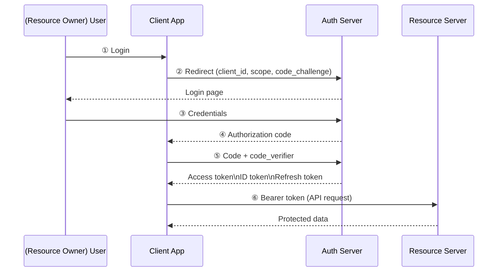
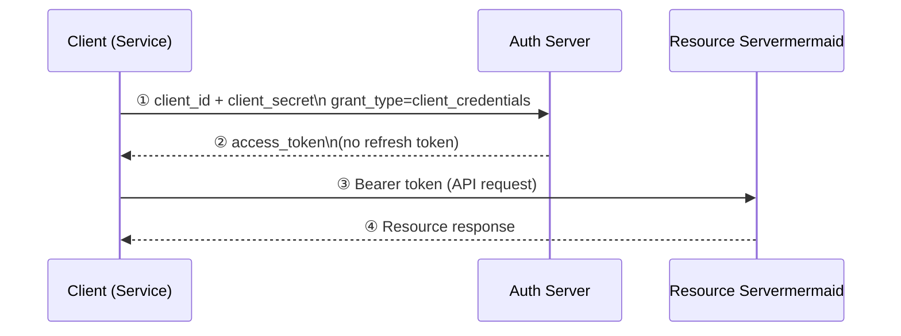

# Phase 1 — Foundations: IAM & Keycloak Basics

> **Timeline:** Month 1  
> **Goal:** Understand the theory, get Keycloak running locally, and complete your first login flow end-to-end.

---

## 1. IAM Fundamentals

### Authentication vs Authorization

| Concept                    | Question it answers           | Example                               |
| -------------------------- | ----------------------------- | ------------------------------------- |
| **Authentication (AuthN)** | _Who are you?_                | Login with username + password        |
| **Authorization (AuthZ)**  | _What are you allowed to do?_ | Admin can delete users; viewer cannot |

### Single Sign-On (SSO)

SSO lets a user log in once and access multiple applications without re-entering credentials. Keycloak acts as the central Identity Provider (IdP) — apps delegate authentication to it instead of managing credentials themselves.

```
User → App A → Keycloak (login once) → Token issued
User → App B → Keycloak (session exists) → Token issued immediately
```

### Identity Federation

Federation allows Keycloak to trust an external IdP (Google, GitHub, LDAP, an enterprise SAML provider) and map their users into Keycloak. Users log in with their existing corporate or social accounts; Keycloak handles the translation.

---

## 2. Core Protocols

### OAuth 2.0

OAuth 2.0 is an **authorization** framework — it defines how an application can obtain limited access to a user's resources without handling their password directly. The key idea: instead of sharing credentials with every app, the user grants a limited-scope token.
 
#### Key roles
 
```
┌─────────────────┐        grants consent        ┌──────────────────┐
│  Resource owner │ ───────────────────────────► │  Authorization   │
│  (end user)     │                              │  server          │
│                 │ ──── authenticates at ──────►│  (Keycloak)      │
└─────────────────┘                              └────────┬─────────┘
                                                          │ issues
                                                          │ access token
┌─────────────────┐        calls API with token  ┌────────▼─────────┐
│  Client         │ ───────────────────────────► │  Resource server │
│  (your app)     │                              │  (your API)      │
└─────────────────┘                              └──────────────────┘
```
 
**Resource Owner** — The person (or system) who owns the data and can authorize access to it. In a typical web app this is the end user logged in to their account. They don't share their password with the client app — they only grant permission.
 
> Example: A user who owns a Google Calendar and wants to let a scheduling app read their events.
 
**Client** — A third-party application that wants to access the resource owner's data *on their behalf*. Before accessing anything, the client must obtain explicit authorization from the resource owner. The client never sees the user's password.
 
> Example: The scheduling app (React frontend + Spring Boot backend) that wants to read calendar events.
 
**Authorization Server** — Authenticates the resource owner, verifies consent, and issues access tokens to clients. This is **Keycloak** in our setup. It is the trust anchor — both the client and the resource server trust it.
 
> Note: The authorization server and resource server can be the same system. In Keycloak's case, Keycloak is the authorization server; your own APIs are the resource servers.
 
**Resource Server** — Stores and serves the protected resources. It accepts access tokens and validates them (by checking the token signature against the authorization server's public key) before returning data.
 
> Example: Your Spring Boot API that serves `/api/orders` or `/api/users`.
 
---
 
#### Grant types (flows)
 
A grant type defines *how* the client obtains an access token. OAuth 2.0 defines four standard flows; Keycloak supports all of them. Choose based on what kind of client you have.
 
| Grant type | Client type | User involved? | When to use |
|---|---|---|---|
| Authorization Code + PKCE | SPA, mobile, web app | Yes | Default for all user-facing apps |
| Client Credentials | Backend service, daemon | No | Machine-to-machine (M2M) |
| Device Code | Smart TV, CLI tool | Yes (on another device) | Input-limited devices |
| Implicit | *(deprecated)* | Yes | Do not use in new projects |
 
---
 
##### Authorization Code flow (with PKCE)
 
The most important flow. Used by any app where a real user logs in. PKCE (Proof Key for Code Exchange) is mandatory for public clients (SPAs, mobile apps) and recommended for confidential clients too.
 

 
Step-by-step:
 
1. User clicks "Login" in the client app.
2. Client redirects the browser to Keycloak's `/auth` endpoint, passing `client_id`, `scope`, `redirect_uri`, and a `code_challenge` (PKCE).
3. User logs in and grants consent on the Keycloak login page.
4. Keycloak redirects back to the app's `redirect_uri` with a short-lived **authorization code**.
5. The client app exchanges the code + `code_verifier` (PKCE) for tokens via a **back-channel** POST (browser never sees the secret exchange).
6. Client app calls the resource server's API using `Authorization: Bearer <access_token>`.
> Why the code step? The authorization code is short-lived and single-use. Even if it leaks from the browser URL, it is useless without the `code_verifier` known only to the client. This is safer than returning the token directly in the redirect.
 
```bash
# Step 5 — token exchange (curl example)
curl -X POST http://localhost:8080/realms/demo/protocol/openid-connect/token \
  -d "grant_type=authorization_code" \
  -d "client_id=demo-app" \
  -d "code=<auth_code>" \
  -d "redirect_uri=http://localhost:3000/callback" \
  -d "code_verifier=<verifier>"
```
 
---
 
##### Client Credentials flow
 
Used when there is no user involved — a backend service authenticating as itself. The client uses its own `client_id` and `client_secret` to get a token. No browser redirect, no login page.
 

 
```bash
curl -X POST http://localhost:8080/realms/demo/protocol/openid-connect/token \
  -d "grant_type=client_credentials" \
  -d "client_id=my-service" \
  -d "client_secret=<secret>"
```
 
> Note: Client Credentials tokens have no `sub` claim for a user and no refresh token. The service simply re-authenticates when the token expires.
 
---
 
##### Refresh Token flow
 
Not a standalone grant — used after Authorization Code flow to obtain a new access token without requiring the user to log in again.
 
```bash
curl -X POST http://localhost:8080/realms/demo/protocol/openid-connect/token \
  -d "grant_type=refresh_token" \
  -d "client_id=demo-app" \
  -d "refresh_token=<refresh_token>"
```
 
The server returns a new `access_token` (and usually a new `refresh_token` — rotate and discard the old one). If the refresh token has expired or been revoked, the user must log in again.
 
---
 
##### Why not Implicit flow?
 
The Implicit flow returned tokens directly in the browser URL fragment (no code exchange step). This was created when browsers could not make cross-origin POST requests. Modern browsers support CORS, so the Authorization Code + PKCE flow is always safer and should be used instead. Keycloak still supports Implicit for legacy clients but it is disabled by default.
 

### OpenID Connect (OIDC)

OIDC is an **identity layer** on top of OAuth 2.0. Where OAuth 2.0 issues an opaque access token to call APIs, OIDC additionally issues an **ID Token** (a JWT) that tells the client _who_ the user is.

```
OAuth 2.0  →  "Here is a token to call this API"
OIDC       →  "Here is a token to call this API" + "Here is who the user is"
```

Key tokens:

- **ID Token** — JWT containing user identity claims (`sub`, `email`, `name`)
- **Access Token** — used to call protected APIs; may be JWT or opaque
- **Refresh Token** — used to obtain new access tokens without re-login

### SAML 2.0

SAML is an older XML-based protocol, still common in enterprise environments. Keycloak supports it for legacy integrations. Prefer OIDC for new projects — it is simpler, JSON-based, and better suited for SPAs and mobile apps.

---

## 3. Keycloak Core Concepts

### Realm

A realm is an isolated namespace. It contains its own users, clients, roles, and settings. Think of it as a tenant.

```
Keycloak instance
├── master realm          ← admin realm, do not use for applications
├── my-app-dev realm      ← development environment
└── my-app-prod realm     ← production environment
```

> **Best practice:** Never use the `master` realm for your own applications. Create a dedicated realm per environment or per product.

### Client

A client represents an application that delegates authentication to Keycloak. Each client has a type:

| Client type    | Use case                                              | Example         |
| -------------- | ----------------------------------------------------- | --------------- |
| `public`       | Browser SPA, mobile app — cannot keep a secret        | React frontend  |
| `confidential` | Backend service that can store a secret securely      | Spring Boot API |
| `bearer-only`  | API that only validates tokens, never initiates login | Microservice    |

### Users & Groups

- **User** — a person (or service account) with credentials stored in Keycloak
- **Group** — a collection of users; roles assigned to a group propagate to all members

### Roles

Roles are permissions assigned to users or clients.

- **Realm roles** — scoped to the entire realm
- **Client roles** — scoped to a specific client
- **Composite roles** — a role that contains other roles

```
user               → realm role: "viewer"
admin              → realm role: "admin" (composite: viewer + write + delete)
service-account-x  → client role: "internal-api-access"
```

### Identity Providers (IdPs)

External identity sources Keycloak can federate with:

- Social: Google, GitHub, Facebook
- Enterprise: Microsoft AD FS, Okta, another Keycloak realm
- Standard: any SAML 2.0 or OIDC-compliant provider

### User Federation

Connects Keycloak to an existing user store — most commonly LDAP / Active Directory. Keycloak syncs or proxies users from the directory; credentials are validated against the external source.

---

## 4. Keycloak Architecture

```
Browser / Client App
        │
        ▼
   Keycloak Server          ← Authorization Server (OAuth 2.0 / OIDC / SAML)
   ┌────────────────────┐
   │  Realm              │
   │  ├─ Clients         │
   │  ├─ Users           │
   │  ├─ Roles           │
   │  └─ Identity Providers│
   └────────┬───────────┘
            │
     ┌──────┴──────┐
     │             │
  Database     User Federation
  (PostgreSQL)  (LDAP / AD)
```

Keycloak persists configuration and user data in a relational database (PostgreSQL recommended for production). By default it ships with an embedded H2 database — fine for development, not for production.

---

## 5. Action Steps

### Step 1 — Run Keycloak with Docker

```bash
docker run -p 8080:8080 \
  -e KEYCLOAK_ADMIN=admin \
  -e KEYCLOAK_ADMIN_PASSWORD=admin \
  quay.io/keycloak/keycloak:latest start-dev
```

Admin console: http://localhost:8080 — log in with `admin / admin`.

### Step 2 — Create a Realm

1. Open the admin console
2. Click the dropdown next to **master** (top-left) → **Create realm**
3. Name it `demo`
4. Click **Create**

### Step 3 — Create a User

1. In the `demo` realm, go to **Users** → **Add user**
2. Set username: `testuser`
3. Go to the **Credentials** tab → set a password, toggle **Temporary** off
4. Click **Save**

### Step 4 — Create a Client

1. Go to **Clients** → **Create client**
2. Client type: `OpenID Connect`
3. Client ID: `demo-app`
4. Client authentication: **Off** (public client)
5. Valid redirect URIs: `http://localhost:3000/*`
6. Click **Save**

### Step 5 — Test Login (OIDC Playground)

Open this URL in your browser (replace values if needed):

```
http://localhost:8080/realms/demo/protocol/openid-connect/auth
  ?client_id=demo-app
  &response_type=code
  &redirect_uri=http://localhost:3000/callback
  &scope=openid profile email
```

Log in as `testuser`. You will be redirected with an authorization `code` in the URL. This confirms the authorization code flow is working.

---
## OIDC Login Flow (Authorization Code Flow)


1. Frontend redirects user to Keycloak login page.
2. User enters username/password (or uses IdP).
3. Keycloak issues tokens (ID Token, Access Token, Refresh Token).
4. Frontend receives tokens and sends the Access Token to the backend API.
5. Backend verifies the Access Token and processes the request.

Backend does not handle user passwords — it only validates tokens for security and scalability.

## 

## Mini Exercise (Understand tokens quickly)

1. Open: https://jwt.io
2. Paste a sample JWT.
3. Observe:
   - `sub` = user ID
   - `preferred_username` = username
   - `realm_access.roles` = roles assigned to the user

This is the data Keycloak sends to applications after login.

--

## 6. Key Takeaways

- Keycloak is an **Authorization Server** — your apps never see user passwords
- Every app registers as a **client** in a **realm**
- OIDC builds on OAuth 2.0 and is the preferred protocol for new projects
- The ID Token identifies the user; the Access Token authorizes API calls
- Keep the `master` realm for Keycloak administration only

---

## 7. Recommended Reading

- [Keycloak documentation — getting started](https://www.keycloak.org/guides)
- [OAuth 2.0 simplified (aaronparecki.com)](https://aaronparecki.com/oauth-2-simplified/)
- [OpenID Connect specification](https://openid.net/specs/openid-connect-core-1_0.html)
- [JWT.io — inspect tokens](https://jwt.io)

---

_Next: [Phase 2 — Intermediate: Configuration & App Integration](./phase-2-intermediate.md)_
